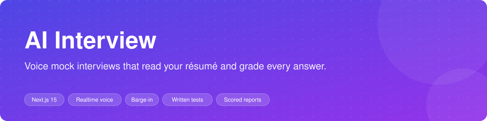
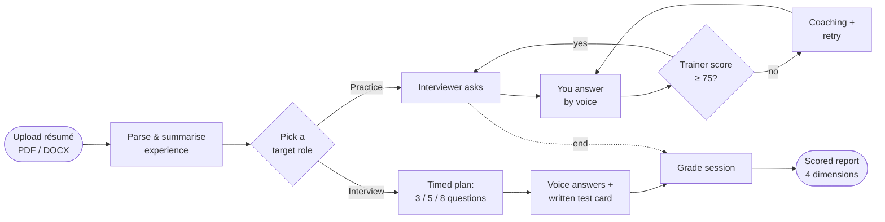
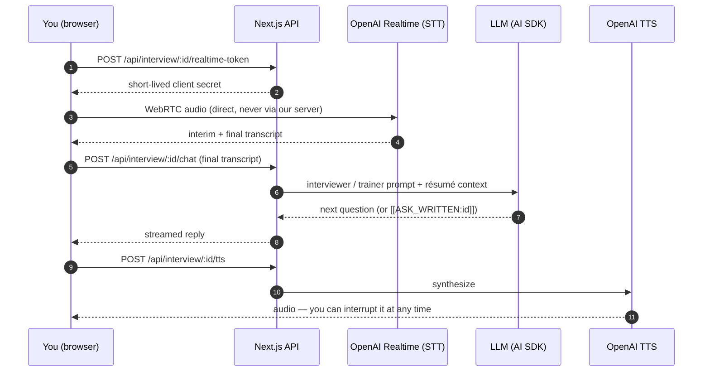
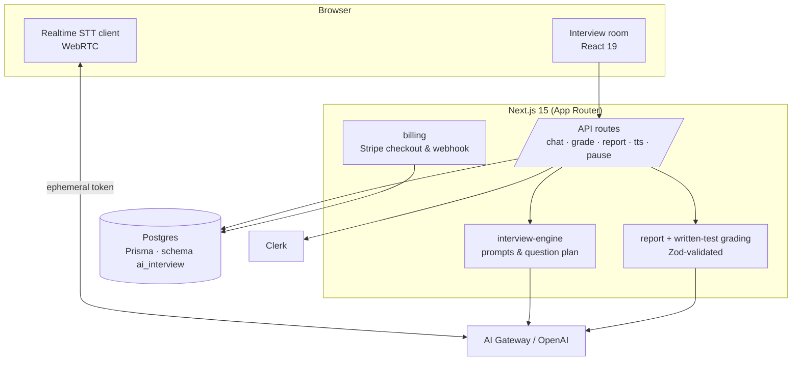

<div align="center">



# AI Interview

**Practice real interviews out loud.** Upload your résumé, pick the role you want, and talk to an AI interviewer that asks follow-ups, lets you interrupt it, sets written tests, and hands you a scored report at the end.

[**Live demo →**](https://ainterv.com) · [How it works](#how-it-works) · [Quick start](#quick-start) · [Architecture](#architecture)


</div>

---

## Why

Reading a list of "top 50 interview questions" does not prepare you for the part that actually goes wrong: **saying the answer out loud, under time pressure, to someone who pushes back.** AI Interview gives you that rehearsal on demand:

- It reads **your** résumé and suggests the roles you are credible for — no generic question bank.
- It **speaks**, and you answer by **voice**. Talk over it and it stops, like a real person would (barge-in).
- In **Practice** mode a second agent, the **Trainer**, scores each answer and coaches you until you clear the bar.
- In **Interview** mode it runs a timed, formal session with a fixed question plan and a written test, then grades you.

## Features

| | |
|---|---|
| 🎙️ **Live voice, both ways** | Word-by-word transcription over WebRTC straight to OpenAI Realtime, and spoken questions via TTS. Audio never passes through our server. |
| ✋ **Barge-in** | Start talking while the interviewer speaks and its voice stops; what you say is captured as your answer. |
| 📄 **Résumé-aware** | PDF / DOCX parsing; the model proposes target roles from your actual experience and tailors every question to it. |
| 🧑‍🏫 **Practice mode** | Interviewer + Trainer. Each answer is scored 0–100; you move on at **75+**, otherwise you get targeted coaching and try again. |
| 🎯 **Interview mode** | Formal and timed. 10 / 20 / 30+ minute sessions ask 3 / 5 / 8 main questions, with a **required written test** at a fixed slot. |
| 📝 **Written tests** | Coding, single-choice, multi-choice and free-text cards, graded separately from the spoken answers. |
| 📊 **Scored report** | Overall score plus Communication, Technical/Role Fit, Structure (STAR) and Confidence, with strengths and concrete improvements. Exportable as HTML. |
| ⏸️ **Pause & resume** | Step away mid-session and continue where you left off; paused sessions never leak into completed reports. |
| 🌍 **Multilingual** | The interview language is configurable per session. |

## How it works



### A single spoken turn



## Architecture



**Data model** (`prisma/schema.prisma`): `User` → `Interview` → `Turn`, plus `InterviewReportCache` (reports are computed once and cached) and `Purchase` (one-time access packs).

## Quick start

**Requirements:** Node 20+, a Postgres database, a [Clerk](https://clerk.com) app, and an OpenAI API key.

```bash
git clone https://github.com/robine198351/ai-interview.git
cd ai-interview
npm install
cp .env.example .env        # fill in the values below
npx prisma migrate deploy
npm run dev
```

Open <http://localhost:3000>, sign up, upload a résumé and start a session.

### Environment

| Variable | Required | Purpose |
|---|---|---|
| `DATABASE_URL` | ✅ | Postgres connection. With a Supabase pooler on `:6543`, add `pgbouncer=true`. |
| `NEXT_PUBLIC_CLERK_PUBLISHABLE_KEY` / `CLERK_SECRET_KEY` | ✅ | Authentication. |
| `OPENAI_API_KEY` | ✅ | Voice (STT + TTS) always calls OpenAI directly. |
| `AI_GATEWAY_API_KEY` | – | Route chat through Vercel AI Gateway; leave empty to use OpenAI directly. |
| `AI_MODEL` | – | Chat model, default `gpt-4o-mini`. |
| `STT_MODEL` | – | Transcription model, default `gpt-4o-transcribe` (`whisper-1` also works). |
| `STRIPE_SECRET_KEY` / `STRIPE_WEBHOOK_SECRET` | – | Paid access packs (day / week / month). Checkout uses inline prices — no Price IDs to create. |
| `NEXT_PUBLIC_SITE_URL` | – | Canonical URL for Open Graph, sitemap and robots. |
| `NEXT_PUBLIC_GA_MEASUREMENT_ID` | – | Google Analytics 4 with first-touch UTM attribution. |

See [`.env.example`](.env.example) for the full list.

## Scripts

| Command | What it does |
|---|---|
| `npm run dev` | Dev server (Turbopack) |
| `npm run build` | `prisma generate` → apply migrations → `next build` |
| `npm start` | Serve the production build |
| `npm run lint` | ESLint |
| `npx prisma studio` | Browse the database |
| `node scripts/smoke-scoring-rubric.mjs` | Smoke-test the scoring rubric |

## Project layout

```
src/app/
  interview/new/          create a session (résumé upload, language, duration)
  interview/[id]/roles/   pick a target role suggested from your résumé
  interview/[id]/room/    the live voice room (STT, TTS, barge-in, written cards)
  interview/[id]/report/  the scored report
  api/interview/[id]/     chat · grade · complete · pause · resume · tts · transcribe · realtime-token · report
  api/billing/            checkout · webhook · refund
src/lib/
  interview-engine.ts     interviewer & trainer prompts, question plan, written-test slots
  report.ts               4-dimension scoring (Zod schema)
  written-questions*.ts   written-test catalog and grading
  resume-parse.ts         PDF / DOCX text extraction
prisma/                   schema + migrations
```

## Deploy

The app is built for **Vercel**: import the repo, set the environment variables above, and deploy. `npm run build` applies pending Prisma migrations before building, so schema changes ship with the code.

## FAQ

**Does my audio get stored?** No. The browser streams audio directly to OpenAI Realtime using a short-lived token; only the resulting transcript is saved with your session.

**Can I use a different model?** Chat goes through the Vercel AI SDK, so any model reachable via AI Gateway works — set `AI_MODEL`. Voice currently requires OpenAI.

**Why is the pass mark 75?** Practice mode is meant to make you *repeat* weak answers. 75 is high enough that a vague answer does not pass, and low enough that a solid one does on the first try.

## Contributing

Issues and pull requests are welcome. If AI Interview helped you prepare, a ⭐ helps other people find it.
